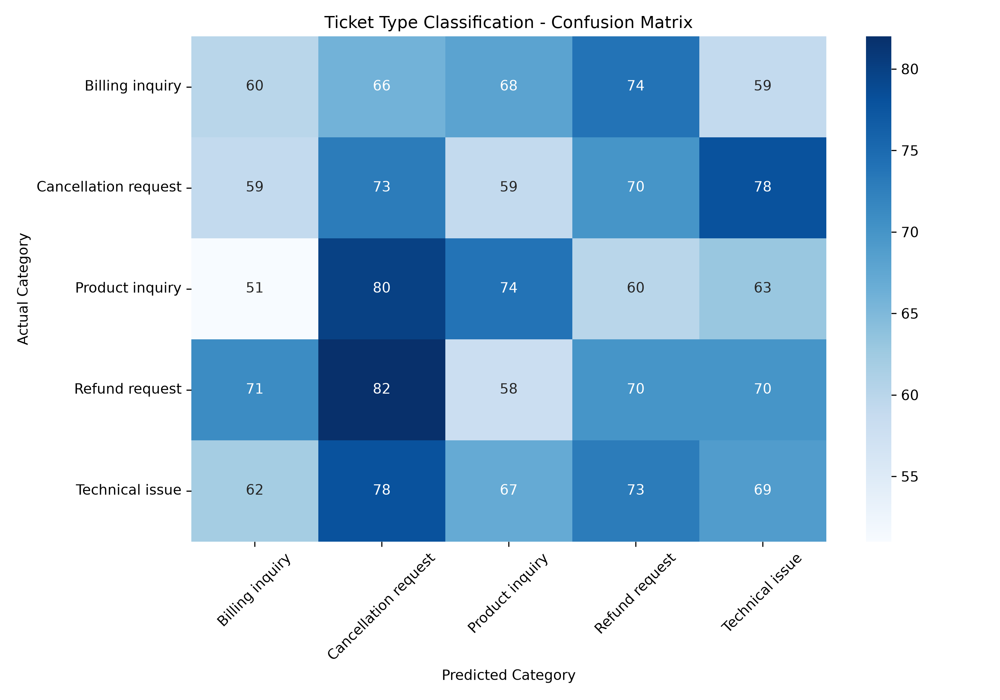
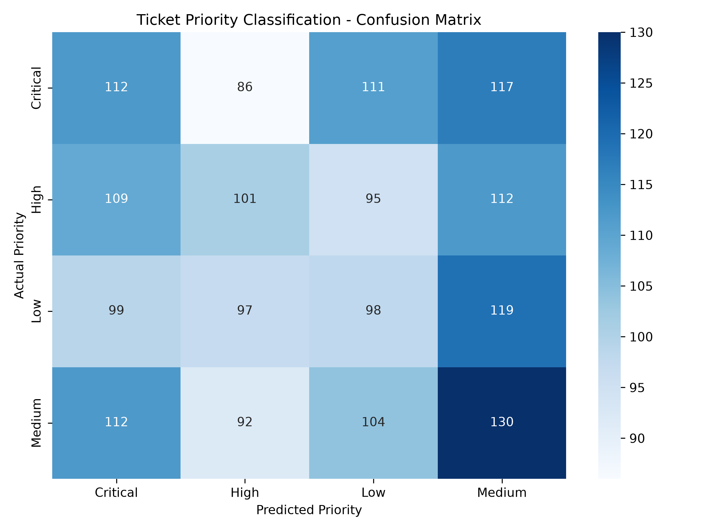

# Support Ticket Classification & Prioritization

## Future Interns — Machine Learning Task 2

A machine learning system that automatically **classifies customer support tickets** and **predicts their priority level** using Natural Language Processing (NLP) and machine learning.

---

## 📌 Project Overview

Customer support teams receive a large number of tickets every day. Manually categorizing and prioritizing these tickets can be time-consuming and may cause urgent issues to be delayed.

This project builds an ML-based decision-support system that automatically:

* Classifies support tickets into appropriate categories
* Predicts the priority of each ticket
* Evaluates model performance using standard ML metrics
* Provides visual analysis using confusion matrices

---

## 🎯 Objectives

The main objectives of this project are:

1. Clean and preprocess customer support ticket text.
2. Convert text into numerical features using TF-IDF.
3. Classify tickets into different ticket types.
4. Predict ticket priority levels.
5. Evaluate the classification models.
6. Demonstrate how machine learning can improve support operations.

---

## 📊 Dataset

The project uses a customer support ticket dataset containing **8,469 usable ticket records** for the text classification workflow.

### Important Features

* Ticket ID
* Customer Name
* Product Purchased
* Ticket Type
* Ticket Subject
* Ticket Description
* Ticket Status
* Ticket Priority
* Ticket Channel
* Customer Satisfaction Rating

The main text feature used for NLP is:

```text
Ticket Description
```

---

## 🏷️ Ticket Categories

The system classifies tickets into the following categories:

* Refund request
* Technical issue
* Cancellation request
* Product inquiry
* Billing inquiry

### Ticket Type Distribution

| Ticket Type          | Count |
| -------------------- | ----: |
| Refund request       | 1,752 |
| Technical issue      | 1,747 |
| Cancellation request | 1,695 |
| Product inquiry      | 1,641 |
| Billing inquiry      | 1,634 |

---

## 🚨 Ticket Priority Levels

The second model predicts:

* Critical
* High
* Medium
* Low

### Priority Distribution

| Priority | Count |
| -------- | ----: |
| Medium   | 2,192 |
| Critical | 2,129 |
| High     | 2,085 |
| Low      | 2,063 |

---

## 🧹 Text Preprocessing

The ticket descriptions were processed before training.

The preprocessing workflow includes:

1. Converting text to lowercase
2. Removing unnecessary punctuation
3. Removing stopwords
4. Cleaning the ticket description
5. Preparing the text for feature extraction

---

## 🔢 TF-IDF Feature Extraction

Machine learning models cannot directly understand raw text.

Therefore, **TF-IDF (Term Frequency-Inverse Document Frequency)** was used to convert ticket descriptions into numerical features.

The implementation uses:

```python
TfidfVectorizer(
    max_features=5000,
    stop_words="english"
)
```

The final feature representation contains:

```text
8,469 tickets
5,000 TF-IDF features
```

---

## 🤖 Machine Learning Models

Two separate classification models were developed using **Logistic Regression**.

### Model 1 — Ticket Type Classification

```text
Ticket Description
        ↓
Text Cleaning
        ↓
TF-IDF
        ↓
Logistic Regression
        ↓
Ticket Type
```

### Model 2 — Ticket Priority Classification

```text
Ticket Description
        ↓
Text Cleaning
        ↓
TF-IDF
        ↓
Logistic Regression
        ↓
Ticket Priority
```

---

## 📈 Model Evaluation

The models were evaluated using:

* Accuracy
* Precision
* Recall
* F1-score
* Confusion Matrix

The detailed evaluation results are available in:

```text
outputs/model_evaluation.csv
```

---

## 📊 Confusion Matrices

### Ticket Type Classification

The confusion matrix shows the relationship between the actual ticket categories and the categories predicted by the model.



### Ticket Priority Classification

The priority confusion matrix shows how effectively the model distinguishes between Critical, High, Medium, and Low priority tickets.



---

## 🧪 Example Prediction

The system can process a completely new support ticket.

Example:

```text
"I was charged twice for my subscription and I need a refund immediately."
```

The system processes the ticket through:

```text
New Ticket
    ↓
Text Cleaning
    ↓
TF-IDF Transformation
    ↓
Ticket Type Model
    ↓
Priority Model
    ↓
Final Prediction
```

This allows the system to provide both:

```text
Ticket Type
Ticket Priority
```

---

## 💼 Business Benefits

This system can help support teams:

* Reduce manual ticket sorting
* Identify important tickets faster
* Organize incoming support requests
* Reduce support backlog
* Improve response prioritization
* Provide more consistent ticket classification
* Allow support agents to focus more on solving customer problems

---

## 🛠️ Technologies Used

* Python
* Pandas
* NumPy
* Scikit-learn
* NLTK
* Matplotlib
* Seaborn
* Jupyter Notebook

---

## 📁 Project Structure

```text
FUTURE_ML_02/
│
├── data/
│   └── customer_support_tickets.csv
│
├── notebooks/
│   └── support_ticket_classification.ipynb
│
├── outputs/
│   ├── business_summary.txt
│   ├── category_confusion_matrix.png
│   ├── model_evaluation.csv
│   └── priority_confusion_matrix.png
│
├── screenshots/
│
├── src/
│
├── .gitignore
├── requirements.txt
└── README.md
```

---

## 🚀 How to Run

### 1. Clone the repository

```bash
git clone https://github.com/jeeva0405/FUTURE_ML_02.git
```

### 2. Navigate to the project

```bash
cd FUTURE_ML_02
```

### 3. Create a virtual environment

```bash
python -m venv venv
```

### 4. Activate the environment

Windows PowerShell:

```powershell
.\venv\Scripts\Activate.ps1
```

### 5. Install dependencies

```bash
pip install -r requirements.txt
```

### 6. Open the notebook

```bash
jupyter notebook
```

Open:

```text
notebooks/support_ticket_classification.ipynb
```

Run the notebook cells in order.

---

## 🔮 Future Improvements

The project can be extended with:

* Advanced NLP models such as BERT
* Real-time ticket classification
* Automated support-ticket integration
* Confidence scores for predictions
* Support team dashboard
* Human review for uncertain predictions
* Automatic email/help-desk integration

---

## 👨‍💻 Project Information

**Program:** Future Interns — Machine Learning Internship
**Task:** Machine Learning Task 2
**Project:** Support Ticket Classification & Prioritization
**Author:** Jeeva K

---

## 📜 License

This project was created for educational and internship purposes.
